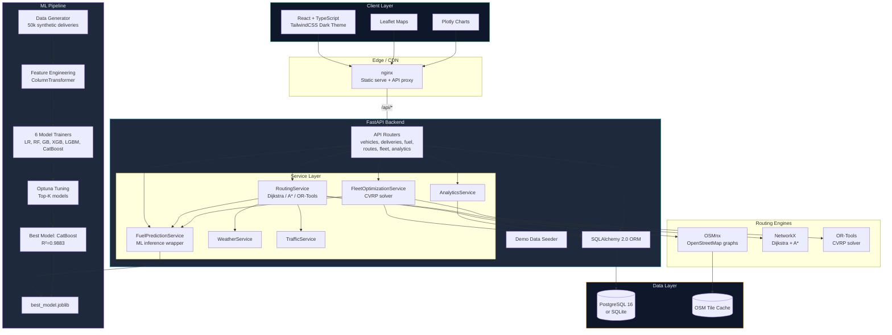
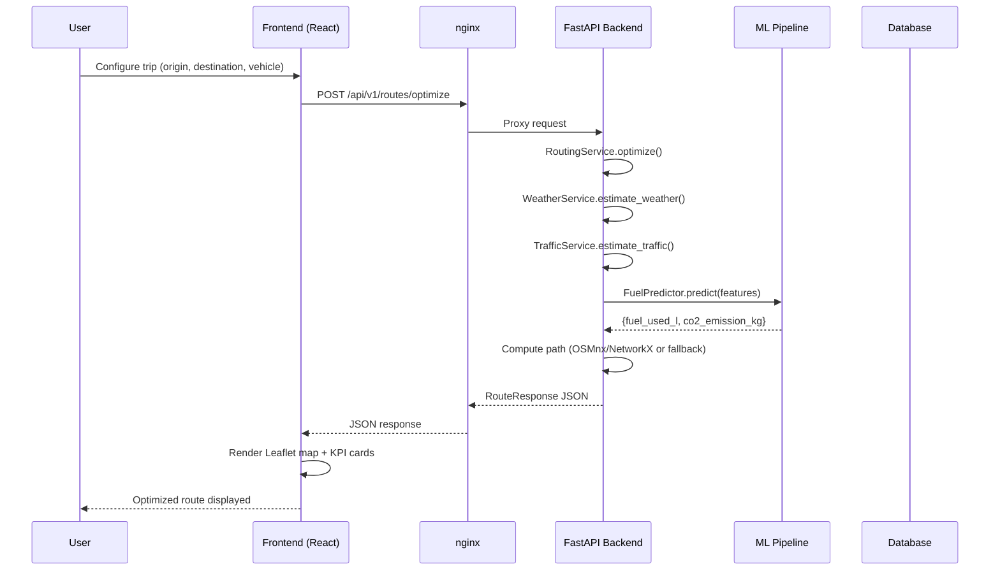
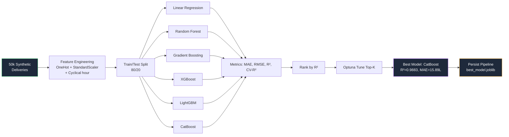
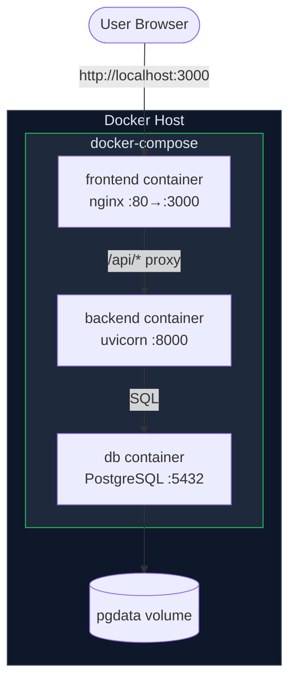

# EcoRoute Architecture Diagram

Below is the high-level architecture rendered from Mermaid. Most Markdown viewers
(GitHub, VS Code) will render the diagram automatically.

## Request Flow

## ML Training Pipeline

## Docker Deployment Topology

